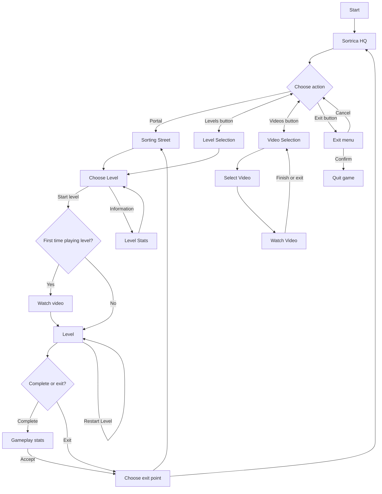

# Algorithmic Inventory Sorter
The proposed serious game, titled "Algorithmic Inventory Sorter," places the user in a virtual workshop where they are tasked with managing items arriving on a conveyor belt. The core mechanic involves interacting with a virtual machine to process these items according to specific rules that mirror the logic of fundamental data structures. For example, one puzzle requires a Last-In, First-Out (LIFO) approach, demonstrating the behavior of a Stack, while another requires a First-In, First-Out (FIFO) approach, demonstrating a Queue. Through this hands-on, puzzle-based interaction, the game aims to make abstract computer science concepts tangible and understandable for learners in an immersive environment.

The expectation is to develop a functional proof of concept serious game prototype with functionalities sufficient to run the study, rather than a fully-fledged serious game.

📁 [Documentation](./doc)
🎮 [Unity project](./code)
🚫 [Data](./data)

Milestones
------
- 28/09 -> Core Prototype and Study Design Complete
- 27/10 -> Data Collection Complete
- 30/11 -> Project Completion and Handover
  
Project Plan
------
### Month 1: Foundation & Prototyping 💻
Goal: Design foundation for the functional prototype of the serious game.
- Weeks 1-2: **Design Document**
- Weeks 3-4: **Core development** (Development of primary game logic and core UI in Unity) + **User study materials**

### Month 2: Accessibility Implementation & User Study 🧍
Goal: To finish accessible prototype and execute the full user study to gather empirical data.
- Weeks 5-6: Implement full suite of **accessibility features** + Recruit and schedule **participants** for the user study
- Weeks 7-8: Conduct a brief **pilot study** + Main **user study sessions** (Collect data on the impact of the accessibility features)

### Month 3: Analysis, Creation & Wind-down 📁
Goal: To analyze the data, produce the final creative outputs, and complete a structured project wind-down.
- Weeks 9-10: **Data Analysis** + Design **fiction podcast episodes**.
- Week 11: Synthesize the **results** + Draft core sections (**Methodology, Results**) of the final project report.
- Weeks 12-13: **Final project report** + Archive **project assets** + Prepare **final presentation** + Complete all **handover documentation**

Development Plan
------
### Core development
1. Basic level functionality
2. Player and NPC models and functionality
3. Tutorial level
4. Basic levels
5. Menus
### Flexible (If posible, in core development, if not, in Extra functionality development)
1. Complete levels, with difficulty settings (Also new models for better aesthetic)
2. Sorting Street
3. Sortica Headquarters
### Whole functionality development
1. Accessibility features
2. Cleanup and improvement
 
### Extra functionality development (If possible)
1. Music and sound

Gameloop
------

