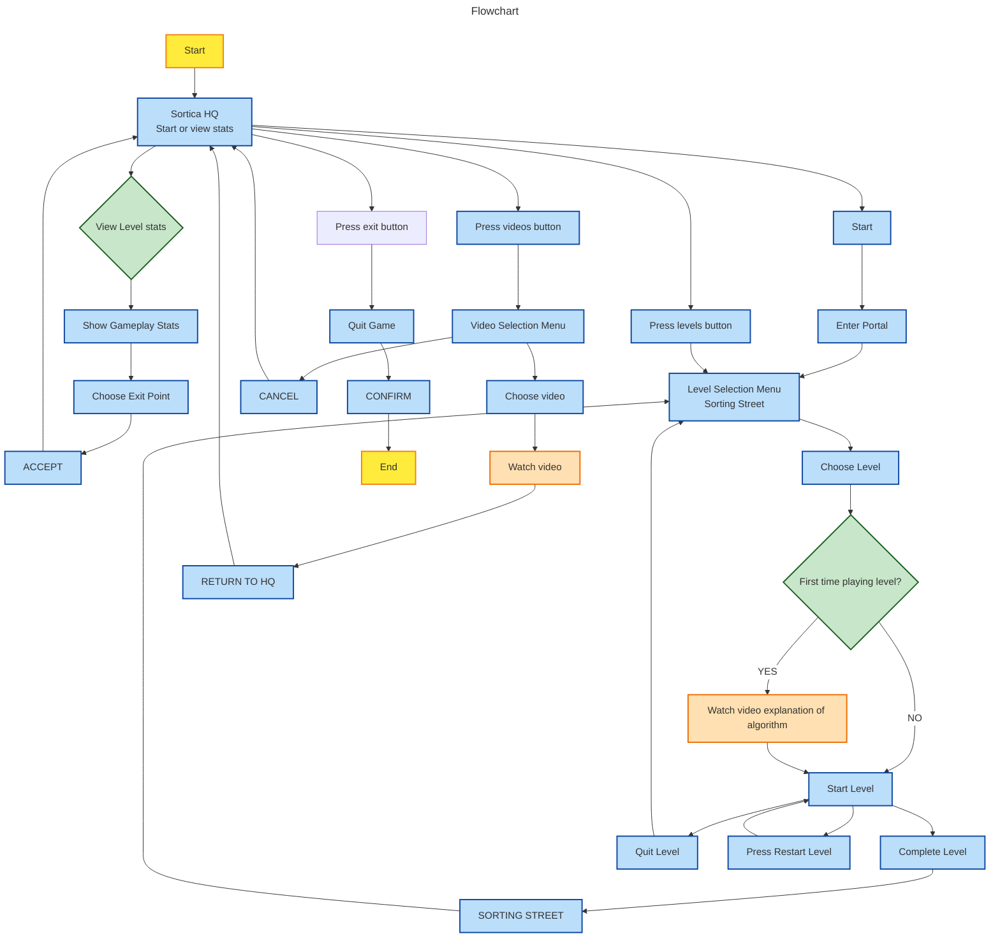

```mermaid!
---
title: Flowchart
---
%%{init: {"themeVariables": {"edgeLabelBackground":"#ffffff"}}}%%
flowchart TD
    A[Start] --> B[Sortica HQ<br/>Start or view stats]
    
    B --> C{View Level stats}
    B --> D[Start]
    B --> E[Press levels button]
    B --> F[Press videos button]
    B --> G[Press exit button]
    
    C --> H[Show Gameplay Stats]
    H --> I[Choose Exit Point]
    I --> J[ACCEPT]
    J --> B
    
    D --> K[Enter Portal]
    K --> L[Level Selection Menu<br/>Sorting Street]
    L --> M[Choose Level]
    
    M --> N{First time playing level?}
    N -->|YES| O[Watch video explanation of algorithm]
    N -->|NO| P[Start Level]
    O --> P
    
    P --> Q[Complete Level]
    P --> R[Quit Level]
    P --> S[Press Restart Level]
    
    Q --> T[SORTING STREET]
    R --> L
    S --> P
    T --> L
    
    E --> L
    
    F --> U[Video Selection Menu]
    U --> V[Choose video]
    U --> W[CANCEL]
    V --> X[Watch video]
    X --> Y[RETURN TO HQ]
    Y --> B
    W --> B
    
    G --> Z[Quit Game]
    Z --> AA[CONFIRM]
    AA --> AB[End]

    %% Estilos
    classDef startEnd fill:#ffeb3b,stroke:#f57f17,stroke-width:2px;
    classDef action fill:#bbdefb,stroke:#0d47a1,stroke-width:2px;
    classDef decision fill:#c8e6c9,stroke:#1b5e20,stroke-width:2px;
    classDef video fill:#ffe0b2,stroke:#ef6c00,stroke-width:2px;

    class A,AB startEnd
    class B,D,E,F,H,I,J,K,L,M,P,Q,R,S,T,U,V,W,X,Y,Z,AA action
    class C,N decision
    class O,X video
```